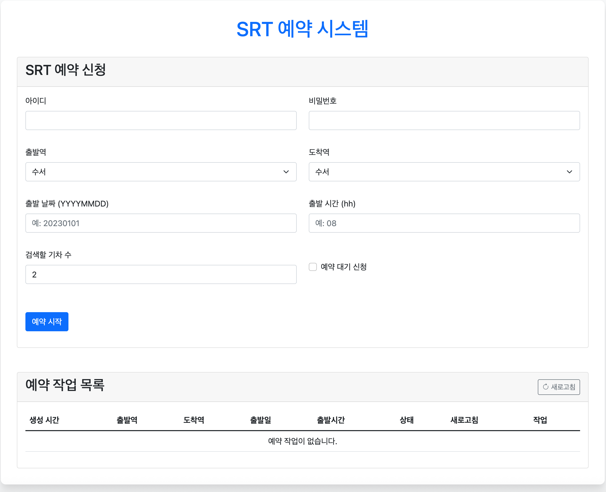

# Python program for booking SRT ticket.

매진된 SRT 표의 예매를 도와주는 파이썬 프로그램입니다.  
원하는 표가 나올 때 까지 새로고침하여 예약을 시도합니다.

## 다운
```cmd
git clone https://github.com/dsskim/srt_reservation.git
```
  
## 필요
- 파이썬 3.7, 3.9에서 테스트 했습니다.

```py
pip install -r requirements.txt
```

# 텔레그램 방 생성
- [텔레그램 방 생성 및 ID 획득 참고](https://blog.naver.com/lifelectronics/223198582215)
- config/telegram_cfg.py 생성
  - 아래는 가상의 값으로 본인 채팅방 token, id 저장

```pytele_conf = {
    'token': '6498go7tEcGuJ-Jz4fgUU',
    'id': 662312257
}
```


## 웹 UI 사용법

웹 인터페이스를 통해 더 쉽게 SRT 예약을 할 수 있습니다.

### 웹 UI 실행하기

```cmd
python app.py
```

위 명령어를 실행하면 Flask 웹 서버가 시작되고, 브라우저에서 `http://localhost:5000`으로 접속할 수 있습니다.

### 웹 UI 사용 방법

1. 웹 브라우저에서 `http://localhost:5000`에 접속합니다.
2. 로그인 정보(아이디, 비밀번호)를 입력합니다.
3. 출발역, 도착역, 출발 날짜, 출발 시간을 선택합니다.
   - 출발 시간은 2시간 단위로만 가능 (0, 2, 4, 6, 8,...)
5. 검색할 기차 수와 예약 대기 신청 여부를 설정합니다.
  - 검색할 기차 수는 출발시간 기준 몇대의 기차까지 예약할 것인지
6. '예약 시작' 버튼을 클릭하면 백그라운드에서 예약 프로세스가 시작됩니다.
7. 예약 상태 페이지에서 실시간으로 진행 상황을 확인할 수 있습니다.



## 기타  
명절 승차권 예약에는 사용이 불가합니다.
